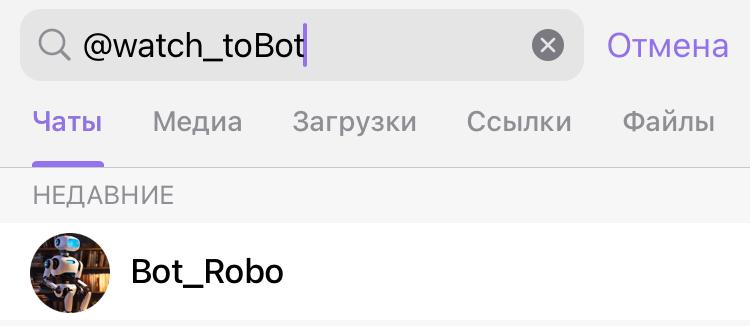

# Bot_Robo

***
Bot_Robo предназначен для поиска кино.

## Описание
***
При создании бота использовались библиотеки: Telebot, requests, BeautifulSoup, random. Все изображения сгенерированы нейросетью (lexica.art).
## Инструкция по применению
***
1. Найти бот в "Телеграме" можно введя в поиск: @watch_toBot

2. Отправьте боту команду /start или /help
